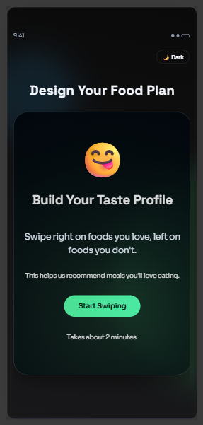
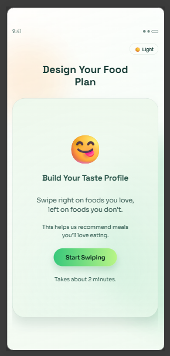
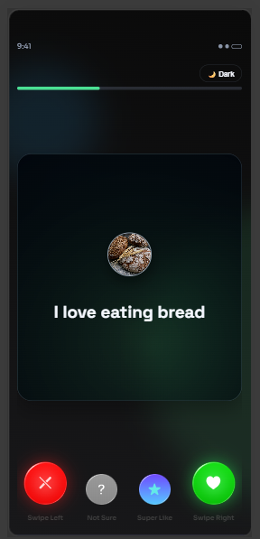
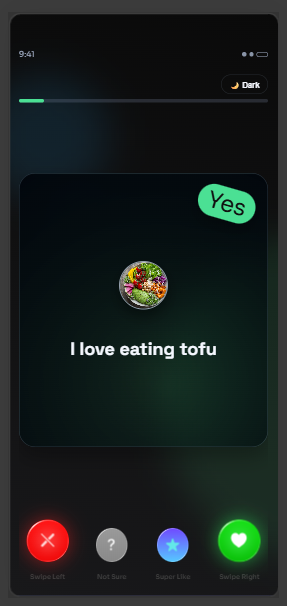
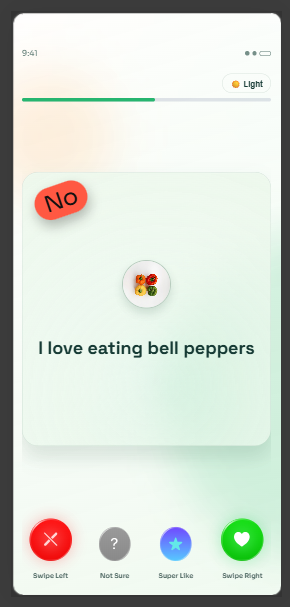
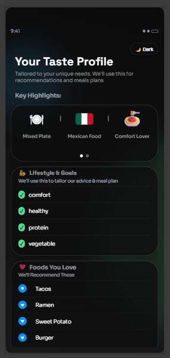
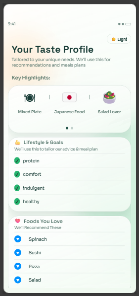

# CalorAI Taste Profile

React app that captures food preferences through swipe interactions and generates a personalized taste-profile dashboard.

## Live Demo

[https://taste-profile.onrender.com/](https://taste-profile.onrender.com/)

## Features

- 3-screen flow: Intro -> Swipe -> Results
- Swipe input via touch, mouse drag, action buttons, and keyboard
- Four reactions: dislike, unsure, super-like, like
- Real-time progress tracking
- Data-driven highlights and results from `foods.json`
- Shareable results links
- Dark theme (reference implementation) + custom light theme
- Theme and profile persistence via `localStorage`
- Mobile-first responsive UI
- Test coverage for key routes and interaction flows

## Tech Stack

- React
- TypeScript
- Vite
- Framer Motion
- Context API
- CSS (token-based theming + glassmorphism)
- Vitest + Testing Library
- Render for Deployment

## Component Architecture Explanation

- `src/App.tsx`: Route orchestration and shared-link routing
- `src/components/AppFrame.tsx`: Shared phone shell and app chrome
- `src/components/ThemeToggle.tsx`: Theme switch control
- `src/pages/IntroPage.tsx`: Entry page
- `src/pages/SwipePage.tsx`: Core interaction flow
- `src/components/FoodCard.tsx`: Swipe card with animation states and badges
- `src/components/SwipeActions.tsx`: Action buttons for all reaction types
- `src/components/ProgressBar.tsx`: Swipe progress indicator
- `src/pages/ResultsPage.tsx`: Data-driven results dashboard + share behavior
- `src/components/InfoListCard.tsx`: Reusable list card for results sections

## State Management Approach And Rationale

State is managed with Context API to keep architecture simple and explicit.

- `ThemeContext`
  - Stores current theme mode
  - Persists theme mode to `localStorage`
  - Applies theme using `data-theme` on the root element

- `TasteProfileContext`
  - Stores swipe decisions and current progression
  - Persists profile state to `localStorage`
  - Derives liked/disliked/super-liked/unsure collections for results

Why Context:

- App-level shared state is limited and well-scoped
- No Redux/Zustand overhead required
- Clear separation between theme concerns and domain (taste profile) concerns

## Custom Hooks Documentation

- `useLocalStorage`
  - Generic persistence helper used by both contexts
  - Handles hydration + updates to `localStorage`

- `useSwipe`
  - Encapsulates drag thresholds and intent detection
  - Supports touch, mouse drag, and keyboard-triggered swipes

- `useTheme`
  - Thin consumer wrapper around `ThemeContext`
  - Centralizes theme read/toggle usage in UI components

## Light Mode Design Rationale

Light mode is intentionally designed, not simply inverted from dark mode.

- Uses warm-neutral + fresh-green surfaces to keep the nutrition/wellness tone
- Preserves glassmorphism through translucent panels, soft borders, and subtle depth
- Improves readability with stronger text contrast and cleaner hierarchy
- Reuses the same spacing/shape system for consistency between themes

## Setup Instructions

1. Install dependencies

```bash
npm install
```

2. Start development server

```bash
npm run dev
```

3. Run lint

```bash
npm run lint
```

4. Run tests

```bash
npm run test
```

5. Build production bundle

```bash
npm run build
```

## Libraries Used And Why

- `react`, `react-dom`: Core app runtime
- `react-router-dom`: Route handling across the 3-page flow
- `framer-motion`: Swipe gestures and transition animation
- `clsx`: Conditional class composition
- `typescript`: Type safety and maintainability
- `vite`: Fast local dev and build tooling
- `vitest`: Test runner aligned with Vite
- `@testing-library/react`, `@testing-library/user-event`: Behavior-oriented component testing

## Time Breakdown

Approximate active implementation time: 5 to 6 hours

- 35m requirements review, solution planning, and architecture setup
- 2h core intro, swipe flow and results derivation implementation
- 1h theming system work (dark alignment + custom light mode)
- 50m responsive behavior fixes and UI polish
- 45m testing, bug fixes, lint/build verification, and final QA checks
- 20m documentation cleanup and screenshot curation

## AI Tool Usage Notes

AI tools were used as a coding partner for:

- planning implementation steps
- architecture review and cleanup
- test-case brainstorming
- refactoring suggestions
- README drafting

All final code and docs were manually reviewed and validated through lint/test/build.

## Screenshots 

### Intro

| Dark | Light |
| --- | --- |
|  |  |

### Swipe

| Dark | Dark (Right Swipe) | Light (Left Swipe) |
| --- | --- | --- |
|  |  |  |

### Results

| Dark | Light |
| --- | --- |
|  |  |

